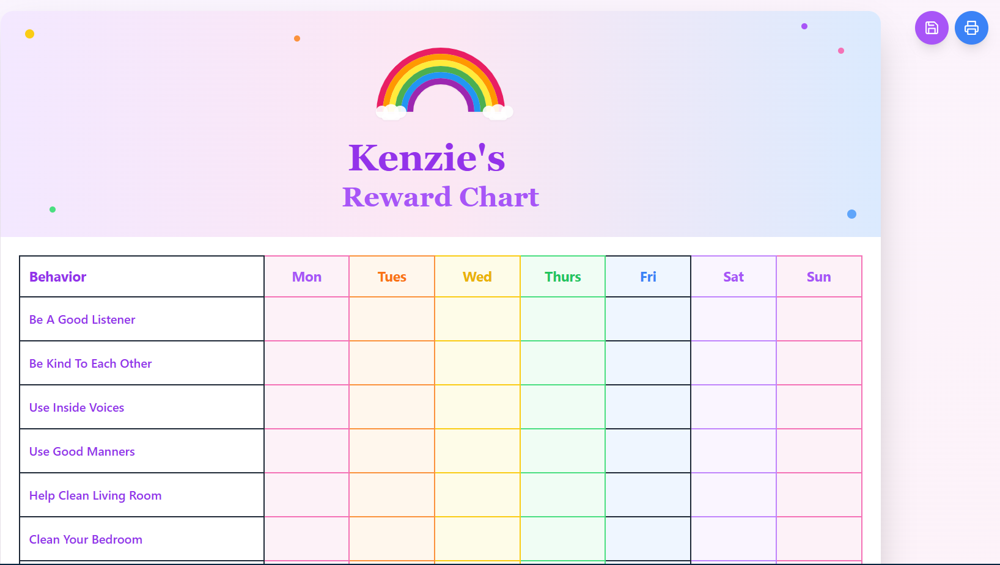

# Interactive Reward Chart Web Application



A beautiful, interactive reward chart application designed to help parents track their children's daily behaviors and achievements. Built with React, TypeScript, and Tailwind CSS.

## Features

- **Interactive Chart**: Click on any day/behavior cell to mark completion with a green checkmark
- **Editable Elements**:
  - Click the edit icon next to the child's name to customize it
  - Edit behavior descriptions by clicking the edit icon next to each behavior
- **Beautiful Design**: Features a colorful rainbow header with decorative elements
- **Print Support**: Optimized print styles for physical reward charts
- **Data Persistence**: Automatically saves progress to browser localStorage
- **Export/Import**: Save chart data as JSON files for backup or sharing

## Default Behaviors

The app comes pre-configured with common childhood behaviors:

- Be A Good Listener
- Be Kind To Each Other
- Use Inside Voices
- Use Good Manners
- Help Clean Living Room
- Clean Your Bedroom
- Clean Your Toy Room
- Work On Using Potty
- Have Good Bath Time

## How to Use

1. **Customize the Name**: Click the edit icon next to the child's name to personalize it
2. **Edit Behaviors**: Click the edit icon next to any behavior to modify the text
3. **Track Progress**: Click on any day cell to mark a behavior as completed
4. **Save Data**: Use the save button to download your chart data
5. **Print**: Use the print button to create a physical copy

## Getting Started

### Prerequisites

- Node.js (v18 or higher)
- npm or yarn

### Installation

1. Clone the repository
2. Install dependencies:

   ```bash
   npm install
